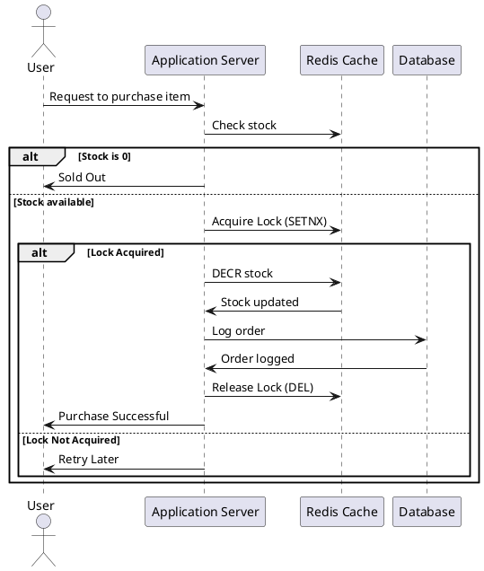

# Atomic Optimistic Locking: Why and How I Use It?

## 1️⃣ Introduction
Handling **high-concurrency transactions** is a big challenge, especially in **flash sale** scenarios where thousands of users try to buy the same product at the same time.

One major issue is **race conditions**, where multiple requests try to modify the same data simultaneously, causing **incorrect stock updates, overselling, or lost transactions**.

To solve this, I use **Atomic Optimistic Locking with Redis**. This ensures that **only one process modifies stock at a time** while allowing high-speed concurrent reads.

---

## 2️⃣ The Problem: Race Conditions in High-Concurrency Systems

### **What is a Race Condition?**
A **race condition** happens when multiple requests try to update the same data **simultaneously**, and the outcome depends on the order of execution, which is unpredictable.

### **Example: Flash Sale Race Condition**
Imagine a **flash sale system** where we have a **limited stock of 5 items**.

#### **Scenario: Two Users Try to Buy at the Same Time**
1. **User A requests to buy 1 item.**
2. **User B requests to buy 1 item at the exact same time.**
3. Both transactions **read stock = 5** from the database.
4. Both transactions **update stock = 4** and commit.

👉 **Result:**  
Even though two items were sold, the final stock should be `3`, but due to the race condition, it's still `4`. This leads to **overselling** or incorrect inventory data.

---

## 3️⃣ Common Solutions and Their Weaknesses

| Approach | How It Works | Pros | Cons |
|-----------|------------|------|------|
| **Pessimistic Locking (DB Locking)** | Locks the row until the transaction completes | Guarantees no conflicts | **Slow, risk of deadlocks** |
| **Optimistic Locking (Version Field)** | Uses a `version` field to detect conflicts | Prevents lost updates | Requires retries, still has **race conditions** |
| **Atomic Redis Locking (SETNX or Lua)** | Locks the operation at the Redis level | **Fast, prevents race conditions** | Needs **Redis failover strategy** |

---

## 4️⃣ Why I Use Atomic Redis Locking?
I prefer **Atomic Redis Locking** because:  
✅ **It ensures only one request modifies stock at a time**.  
✅ **It eliminates transaction retries**.  
✅ **It is faster than database locks**.  
✅ **It reduces the load on the database** by handling stock updates in Redis first.  

---

## 5️⃣ How Atomic Redis Locking Works
### **Step-by-Step Process**
1. **User requests to buy an item**.
2. **Application checks Redis for stock**.
3. **Application acquires a lock using Redis** (`SETNX` or Lua script).
4. **If the lock is acquired:**
   - The stock is **decremented in Redis**.
   - The order is **logged in the database**.
   - The lock is **released**.
5. **If the lock is NOT acquired:**  
   - The user **waits or retries**.

---

## 6️⃣ Example: Redis Atomic Locking with Lua Script

### **🔹 Redis Lua Script for Atomic Locking**
```lua
local stock = redis.call("GET", KEYS[1])
if stock and tonumber(stock) > 0 then
    redis.call("DECR", KEYS[1])
    return 1 -- Success
else
    return 0 -- Out of stock
end
```
#### **Explanation:**
- `GET stock` → Reads current stock.
- `if stock > 0` → Checks if stock is available.
- `DECR stock` → Atomically decrements stock.
- Returns `1` if successful, `0` if out of stock.

### **🔹 Implementation in Golang**
```go
result, err := redis.Eval(ctx, `
    local stock = redis.call("GET", KEYS[1])
    if stock and tonumber(stock) > 0 then
        redis.call("DECR", KEYS[1])
        return 1
    else
        return 0
    end
`, []string{"stock:product:123"}).Int()
```
✅ **This ensures only one request decrements stock at a time.**  

---

## 7️⃣ Sequence Diagram: Flash Sale with Redis Locking


---

## 8️⃣ What Problems This Solves
- **Prevents race conditions** 🏆
- **Eliminates database contention** 🚀
- **Ensures atomic stock updates** ⚡

---

## 9️⃣ Why Not Just Use Optimistic Locking?
Optimistic locking (using a `version` field in the database) is a good choice **only when the transaction is simple**.  
However, for **high-concurrency systems** like flash sales:
❌ **It requires multiple retries**.  
❌ **It still has a small race condition chance**.  
❌ **Database load increases due to retries**.  

✅ **Redis atomic locking eliminates these issues by handling it at the caching layer before the database.**

---

## 🔟 Conclusion
🔹 **Optimistic Locking** (with a version field) is good for small-scale updates.  
🔹 **Pessimistic Locking** is slow and can cause deadlocks.  
🔹 **Atomic Redis Locking** is **fast, prevents race conditions, and scales well**.  

👉 **For high-concurrency flash sales, I prefer Atomic Redis Locking because it eliminates transaction retries and ensures only one process modifies stock at a time.** 🚀  

---
